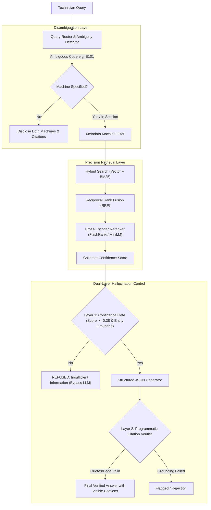

# Factory Floor RAG Troubleshooting Assistant: System Architecture

## 1. Overview
The Factory Floor RAG Troubleshooting Assistant is engineered for high-reliability, zero-hallucination diagnostics in industrial settings. Unlike naive "chat-with-PDF" wrappers, this system treats technical manuals as structured, multi-dimensional knowledge bases where exact error codes, hardware models, and procedural sequences are preserved and strictly verified.



---

## 2. Chunking Strategy
Industrial technical manuals contain interconnected hierarchies: warning headers, error codes, tabular alarm matrices, and diagnostic decision trees. Naive fixed-token chunking splits tables across chunks and severs cause-and-effect relationships.

### Structural & Section-Aware Chunking:
1. **Layout & Table Preservation**:
   - PyMuPDF (`fitz`) layout analysis with `page.find_tables()` identifies table bounding boxes.
   - Tables are extracted into formatted Markdown tables and preserved as single atomic chunks.
   - Non-table text blocks exclude table areas, preventing mangled text and duplicate tokens.
2. **Context Injection Header**:
   - Every chunk is prepended with canonical document hierarchy metadata:
     ```
     [Manual: {manual_name} | Machine: {machine_name} (Model {model}) | Section: {section} | Page: {page}]
     ```
   - This ensures dense embeddings and keyword indexes always have machine, section, and page coordinates embedded in the token space.
3. **Regex Entity Tagging**:
   - During chunking, regex identifies all mentioned error codes (`E\d{3,4}`) and attaches them to `codes_mentioned` metadata.
   - A global `metadata_registry.json` is compiled, cataloging which machines define which error codes.

---

## 3. Retrieval Strategy: Precision Over Recall
On a factory floor, retrieving a "plausible but wrong" error code is a safety hazard. We tune aggressively for precision:

### Hybrid Retrieval & Reciprocal Rank Fusion (RRF):
1. **Keyword BM25 Index (`rank_bm25`)**:
   - Uses a custom tokenizer preserving technical hyphenated codes (`E101`, `SP-500-BRG`, `ACM-500`, `TB4-12`).
   - Dense embeddings struggle with single-character differences (`E101` vs `E102`), whereas BM25 matches exact alphanumeric tokens deterministically.
2. **Dense Vector Index (`ChromaDB` + `FastEmbed`)**:
   - Uses `BAAI/bge-small-en-v1.5` running locally via ONNX Runtime.
   - Captures natural language symptom descriptions (e.g., "why is the press overheating?") where no explicit error code is entered.
3. **Reciprocal Rank Fusion**:
   $$RRF(d) = \frac{w_{bm25}}{k + rank_{bm25}(d)} + \frac{w_{vec}}{k + rank_{vec}(d)}$$
4. **Local Cross-Encoder Reranking (`FlashRank` / `ms-marco-TinyBERT`)**:
   - Reranks candidate passages based on full cross-attention.
   - **Exact Code Precision Modifier**: Chunks containing the queried code with step-by-step actions receive an exact-code priority boost, ensuring the specific troubleshooting section ranks #1.

---

## 4. Cross-Document Disambiguation
When an error code exists in multiple manuals (e.g., `E101` means *Spindle Drive Overcurrent* on the ApexCNC UltraMill 500, but *Platen Thermocouple Disconnect* on the ThermaPress Pro 2000):
- The `QueryRouter` queries `metadata_registry.json`.
- If no machine is specified in the query or active session memory, the system **never silently picks one**.
- It returns status `AMBIGUOUS_DISCLOSED` and displays both meanings side-by-side with distinct manual, section, and page citations, and prompts the technician to clarify their machine.

---

## 5. Dual-Layer Hallucination Control Mechanism
Prompt instructions alone ("do not hallucinate") fail under subtle edge cases. This architecture enforces two deterministic programmatic barriers:

### Layer 1: Retrieval & Confidence Gate (Pre-Generation)
- Evaluates the top cross-encoder relevance score against `CONFIDENCE_THRESHOLD = 0.38`.
- Checks salient entity grounding: extracts non-stopword query keywords (e.g. "laser", "scanner") and verifies that at least 70% of salient query terms exist in the retrieved chunks.
- If score is below threshold or key entities are absent:
  - **The LLM call is completely bypassed.**
  - An immediate, deterministic `REFUSED_INSUFFICIENT_INFORMATION` response is returned.

### Layer 2: Programmatic Citation & Claim Verifier (Post-Generation)
- Forces the LLM to return strictly typed JSON with explicit citation objects:
  ```json
  {
    "manual_name": "...",
    "section": "...",
    "page": 6,
    "supporting_quote": "..."
  }
  ```
- Before displaying the answer, Python code validates:
  1. Does `(manual_name, page)` exist in the retrieved chunks?
  2. Does `supporting_quote` match text in the retrieved chunk (exact substring or $\ge 65\%$ token overlap)?
  3. Are part numbers (e.g. `#SP-500-BRG`) present in source chunks?
- If any citation fails verification, `verification_passed` is set to `False` and flagged.

---

## 6. Conversational Memory & Escalation
- In-memory `SessionManager` maintains `active_machine`, `active_code`, `active_issue_summary`, and turn history.
- When anaphoric or follow-up questions are submitted (*"and what if that doesn't fix it?"*), the query router inherits the session's active machine and error code, executing targeted retrieval for escalation procedures (e.g., secondary component replacement kits) without requiring the technician to repeat context.
