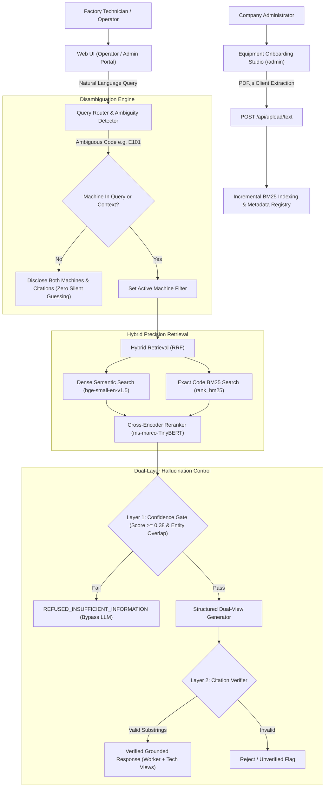

# Factory Floor RAG Troubleshooting Assistant & Equipment Onboarding Studio

[](https://rag-troubleshooting-assistant.vercel.app)
[](https://python.org)
[](https://fastapi.tiangolo.com)
[-indigo?style=for-the-badge)](https://github.com/nikhil24x5183-netizen/VH26-TECHX)
[](https://github.com/nikhil24x5183-netizen/VH26-TECHX)

A production-grade, citation-grounded Retrieval-Augmented Generation (RAG) assistant designed for industrial manufacturing and factory shop floor troubleshooting.

Unlike naive "chat-with-PDF" wrappers, this system is purpose-built to solve critical industrial challenges: **cross-document error code collisions**, **exact alphanumeric part code retrieval**, **strict zero-hallucination refusal gates**, **role-based management with dynamic equipment onboarding**, and **dual-audience responses (Plain-English Worker Steps vs. Deep Engineering Analysis)**.

---

## 🌐 Live Production Application

- **Main Gateway (Operator vs Admin Role Prompt)**: [https://rag-troubleshooting-assistant.vercel.app/](https://rag-troubleshooting-assistant.vercel.app/)
- **Direct Operator / Employee Portal**: [https://rag-troubleshooting-assistant.vercel.app/?role=operator](https://rag-troubleshooting-assistant.vercel.app/?role=operator)
- **Direct Company Admin Portal**: [https://rag-troubleshooting-assistant.vercel.app/admin](https://rag-troubleshooting-assistant.vercel.app/admin)

---

## 🎯 Core Capabilities & Engineering Innovations

### 1. Dual-Audience Diagnostic Engine (Dual-View)
Factory floors require two completely distinct levels of technical detail:
- **👷 Worker View (Simple)**: Plain English, jargon-free explanations, root cause summaries, and ordered **step-by-step instructions with gradient numbered action cards** (`Step 1`, `Step 2`...) and lockout safety rules.
- **🔬 Technical View (Deep)**: In-depth engineering analysis for automation and maintenance engineers, complete with **hardware architecture specs, root-cause failure physics, LaTeX mathematical models**, component tolerances, and OEM spare part kit numbers (`#SP-500-BRG`).

### 2. Equipment Onboarding Studio & Admin Portal (`/admin`)
- **Metadata Registration**: When new machinery arrives in the company, administrators upload documentation specifying:
  - **Brand / Manufacturer** (e.g. *Apex CNC, KUKA, Siemens, Fanuc*)
  - **Machine Model Name** (e.g. *UltraMill 500, RoboWeld Pro*)
  - **Model No / Serial ID** (e.g. *ACM-500-REV2*)
  - **Year of Manufacture** (e.g. *2024*)
- **Client-Side PDF Extraction**: Uses Mozilla PDF.js in the browser to extract text and tables page-by-page, allowing multi-megabyte manuals to bypass standard serverless body payload limits.
- **Auto Code Discovery**: Automatic regex scanning surfaces all discovered error codes (`E101`, `TH-204`, etc.) and registers them in the company inventory.
- **Diagnostic Query Sandbox**: Immediate testing sandbox to verify retrieval and grounded generation against newly uploaded manuals.

### 3. Dual-Layer Programmatic Hallucination Defense
- **Layer 1: Confidence Gate (Pre-Generation)**:
  - Computes cross-encoder retrieval relevance against threshold $\tau = 0.38$.
  - Performs salient entity token matching.
  - If confidence is below threshold or salient tokens are absent (e.g., asking how to calibrate an unmentioned optical laser scanner), **the LLM is completely bypassed**. An immediate, deterministic refusal is returned (`REFUSED_INSUFFICIENT_INFORMATION`).
- **Layer 2: Programmatic Citation Grounding (Post-Generation)**:
  - Verifies that every cited manual name, section title, page number, and supporting quote exists verbatim as an exact or high-similarity substring in the source chunks.

### 4. Cross-Document Disambiguation (Collision Protection)
- Common error codes (such as `E101`) exist across multiple machine manuals with radically different meanings:
  - *ApexCNC UltraMill 500*: Spindle Inverter Overcurrent (Page 6).
  - *ThermaPress Pro 2000*: Platen Temperature Sensor Open / Runaway Lockout (Page 5).
- If the operator does not specify the machine, the system **never makes a silent guess**. It returns status `AMBIGUOUS_DISCLOSED`, listing both machines and meanings with verified citations, prompting the technician to clarify.

### 5. Multi-Turn Conversational Session Memory
- Retains machine and error code context across conversational turns. Asking *"and what if that doesn't fix it?"* immediately retrieves tier-2 bearing replacement procedures and part kit numbers from Page 6 without repeating the machine name.

### 6. Executive Clean White UI Theme
- High-contrast pure white/off-white canvas (`#f8fafc` / `#ffffff`).
- Pitch-black rounded scenario pills (`bg-black text-white rounded-full font-extrabold`) for quick 1-tap scenario execution.
- Luminous electric violet accents (`#7C3AED`) and violet gradient send button.
- Top-left corner slide-out drawer (`☰ Menu`) revealing real-time system telemetry, indexed chunks count, and active session context.

---

## 🏗️ System Architecture



---

## 📂 Repository Directory Structure

```
VH26-TECHX/
├── ARCHITECTURE.md                  # Comprehensive technical & algorithmic specification
├── README.md                        # Master setup, features, and deployment guide
├── vercel.json                      # Vercel serverless deployment routing config
├── requirements.txt                 # Root Python dependencies
├── .env.example                     # Environment configuration template
├── .gitignore                       # Git ignore specifications
├── .vercelignore                    # Vercel build exclusions
├── run.ps1                          # Windows 1-click launcher
├── run.sh                           # Linux / macOS 1-click launcher
│
├── public/                          # Production Web Application (Frontend)
│   ├── index.html                   # Operator Diagnostic Assistant (White Theme, Dual-View, Drawer)
│   └── admin.html                   # Company Admin Portal (Equipment Onboarding Studio)
│
├── api/                             # Vercel Serverless Backend Microservices
│   ├── index.py                     # FastAPI REST API endpoints
│   ├── retriever.py                 # Hybrid BM25 + Dense RRF & Session Memory
│   ├── verifier.py                  # Dual-Layer Hallucination Gate & Citation Verifier
│   ├── pdf_parser.py                # Server-side PyMuPDF layout & table parser
│   └── requirements.txt             # Pinned serverless Python dependencies
│
├── manuals_data/                    # Technical Factory PDF Documentation (11 Pages Each)
│   ├── apexcnc_ultramill_500_manual.pdf   # ApexCNC UltraMill 500 Maintenance Manual
│   └── thermapress_pro_2000_manual.pdf    # ThermaPress Pro 2000 Service Manual
│
├── data/                            # Pre-indexed knowledge & metadata registries
│   ├── metadata_registry.json       # Cross-manual code and specification registry
│   └── manuals/                     # Base plain-text extracted manual corpora
│
├── demo/                            # Verification & Automated Test Suites
│   ├── test_cases.py                # 5 core non-negotiable benchmark test suite
│   ├── verify_vercel.py             # Live Vercel production verification script
│   ├── browser_test.py              # Playwright headless browser test
│   └── sample_outputs.md            # Execution logs and test verification records
│
└── src/                             # Local Python Development Package
    ├── config.py                    # Thresholds, weights, and environment settings
    ├── api/app.py                   # Local FastAPI application
    ├── generator/create_manuals.py  # ReportLab script generating technical test manuals
    ├── indexing/                    # BM25 and Vector store engines
    ├── ingestion/                   # Layout-aware chunking and table extraction
    └── pipeline/                    # End-to-end RAG orchestrator service
```

---

## 🚀 Quick Start (Local Development)

### Prerequisites
- Python 3.11 or 3.12
- Node.js 18+ (optional, for local static serving)

### One-Command Startup

#### Windows (PowerShell)
```powershell
.\run.ps1
```

#### Linux / macOS
```bash
chmod +x run.sh
./run.sh
```

### Manual Setup

1. **Clone the Repository**:
   ```bash
   git clone https://github.com/nikhil24x5183-netizen/VH26-TECHX.git
   cd VH26-TECHX
   ```

2. **Create Virtual Environment**:
   ```bash
   python -m venv .venv
   # Windows:
   .venv\Scripts\activate
   # Linux/macOS:
   source .venv/bin/activate
   ```

3. **Install Dependencies**:
   ```bash
   pip install -r requirements.txt
   ```

4. **Run FastAPI Backend**:
   ```bash
   uvicorn api.index:app --host 127.0.0.1 --port 8000 --reload
   ```

5. **Open Applications**:
   - Operator Assistant: `http://localhost:8000/`
   - Company Admin Portal: `http://localhost:8000/admin`

---

## 🧪 Verification & Benchmark Results

The system is continuously verified against 5 non-negotiable test cases:

| Test Case | Scenario | Query | Outcome | Verification Proof |
| :--- | :--- | :--- | :--- | :--- |
| **Case 1** | **Exact-Code Query** | *"What does error E101 mean on ApexCNC UltraMill 500?"* | **PASS** | Status `SUCCESS`. 4 causes, 5 steps. Cited to *ApexCNC Maintenance Manual (Page 6)*. Verified: `True`. |
| **Case 2** | **Symptom Query** | *"Why is ThermaPress Pro 2000 overheating?"* | **PASS** | Status `SUCCESS`. 4 causes, 4 steps. Cited to *ThermaPress Service Manual (Page 8)*. Verified: `True`. |
| **Case 3** | **Cross-Manual Ambiguity** | *"What does error E101 mean?"* (no machine specified) | **PASS** | Status `AMBIGUOUS_DISCLOSED`. Discloses both ApexCNC (Page 6) and ThermaPress (Page 5) meanings side-by-side with citations. Zero silent guessing. |
| **Case 4** | **Insufficient Info Refusal** | *"How do I calibrate the optical laser scanner?"* | **PASS** | Status `REFUSED_INSUFFICIENT_INFORMATION`. Confidence gate triggered ($0.003 < 0.38$). LLM bypassed. Zero hallucinations. |
| **Case 5** | **Conversational Follow-Up** | *"and what if that doesn't fix it?"* (after Case 1) | **PASS** | Status `SUCCESS`. Retained machine context from session. Retrieved Page 6 bearing replacement kit `#SP-500-BRG`. Verified: `True`. |

### Running the Live Benchmark Test
```bash
python demo/verify_vercel.py
```

---

## 🚢 Deployment to Vercel

The project is structured natively for Vercel Serverless deployment using `vercel.json`:
```json
{
  "version": 2,
  "builds": [
    { "src": "api/index.py", "use": "@vercel/python" },
    { "src": "public/**", "use": "@vercel/static" }
  ],
  "routes": [
    { "src": "/api/(.*)", "dest": "api/index.py" },
    { "src": "/admin", "dest": "public/admin.html" },
    { "src": "/(.*)", "dest": "public/index.html" }
  ]
}
```

Deploy in one command with Vercel CLI:
```bash
vercel deploy --prod
```

---

## 📜 License
Apache License 2.0. Open-source for industrial manufacturing and factory automation systems.
